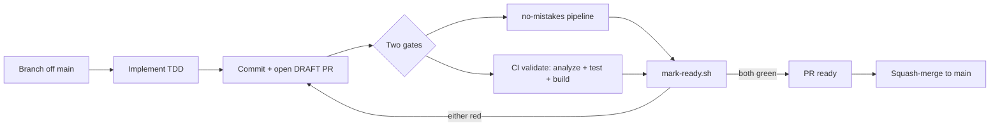
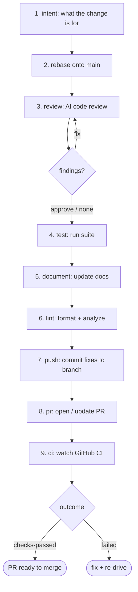

# Automated Commit → Validate → Merge Flow

Every change is committed on a **feature branch** and gated by **two independent
validators** before it can reach `main`:

1. **`no-mistakes`** — a local, AI-driven pipeline (code review → tests → docs → lint).
2. **CI `validate`** — GitHub Actions (`flutter analyze` + `flutter test` + `flutter build web`).

A change is mergeable **only when both are green**. Direct pushes to `main` never happen.

## Enforcement: draft-until-green

The repo is private on GitHub's free plan, so server-side branch protection isn't
available. Instead we exploit a free, native guarantee: **GitHub never lets a *draft*
PR be merged.**

- Every PR opens as a **draft** (unmergeable by default).
- A guard script, **`scripts/mark-ready.sh <pr>`**, flips it to *ready* **only if**
  CI `validate` == `SUCCESS` **and** the `no-mistakes` run actually passed
  (review + test completed, not skipped). Otherwise it refuses.
- You merge only **ready** PRs — so "ready" *means* "validated."

## End-to-end flow

## How `no-mistakes` works

A staged pipeline; each stage can auto-fix and re-run. The **review** stage parks at a
gate where findings are resolved (`fix` / `approve` / escalate to a human), then the
fixed commits flow through the rest and land on the PR.

**Outcomes:** `checks-passed` = validated + CI green (ready to merge) · `failed` =
re-drive after addressing the cause.

## Why two gates

`no-mistakes` is a deep **code-review + auto-fix** layer (catches logic/UX bugs, dead
code, races); CI `validate` is the **fast, reproducible** check on a clean machine and
the **visible, enforceable** signal on the PR. The guard requires both, so a PR is only
mergeable after a real review *and* a clean build — fully hands-off once driven to
`checks-passed`.
